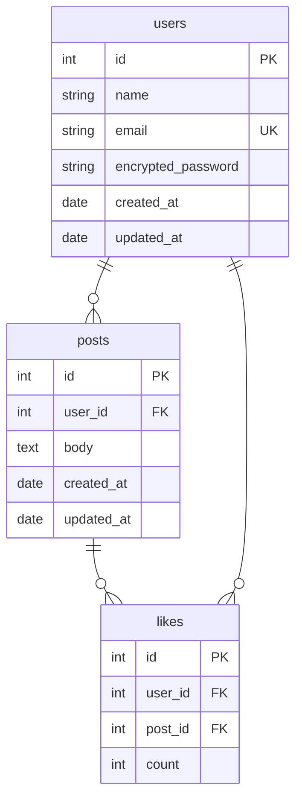

# ■サービス概要
このアプリは、ぐだぐだしがちな休日を有意義に過ごすためのサポートを行うアプリです。  
ユーザーは休日の予定を「宣言」し、共有することで目標に集中することができます。  
宣言を通じて、充実した休日が過ごせるようサポートします。  

# ■ このサービスへの思い・作りたい理由
このアプリのアイデアは、RUNTEQ（プログラミングスクール）での経験から生まれました。  

RUNTEQ、特に私の同期の中では、学習を始める前に「やることを宣言する」という文化があります。  
その効果を実感するにつれて、「RUNTEQの中だけではもったいない。『宣言』は日常生活も有意義にできるはずだ」と感じました。  

このアプリは「宣言」と「休日」が大きなコンセプトです。それぞれについて述べていきます。

## 「宣言」をテーマにした理由
例を通して、私の考える「宣言」が持つ力を示します。
### 例
- 「記事を書きたい」
- 「キャッチアップしたい」
- 「ポートフォリオつくりたい」
- 「家事もやらなきゃ」・・・  
#### 宣言がない場合
- 「どれをやろうかな・・・」
- 「とりあえず記事書いてるけど、やっぱり家事をやろう」
- 「とりあえず記事書いてるけど、ポートフォリオも作らなきゃな・・・」
- 「1日が終わったけど、今日何ができて、何ができてないんだっけ」
- 「洗濯干すのを忘れてた！」

#### 宣言した場合
- 「自分は何をやるべきか、宣言の前に考えないと」
- 「宣言したからには、これに集中しよう」
- 「今日の宣言を見返して、達成状況がわかるな」

### 「宣言」の持つ力

#### やりたいことが整理できる  
「やることを宣言する」前には、必ず「やりたいこと」の選別が行われます。  
その過程で「自分が本当にやりたいこと・やるべきこと」が明確になります。

#### 優先順位に悩まない  
事前に考えて宣言しているため、目標の優先順位に納得感があり、作業に集中できます。  

また、「他人に見られる」ことで責任感が生まれ、目標達成の意欲が高まります。  

#### スイッチが切り替わる
「宣言」をすると、自然と他の物事を忘れ、宣言した目標に集中できると感じています。

これは「納得感」「責任感」とは違った感覚です。

#### 振り返りができる
目標を宣言することで、「目標を達成できたか、できていないか」がひと目でわかります。  
この振り返りにより、作業時間の見積もりや、翌日以降のタスクを洗練させていくことができます。

#### 応援されると頑張れる
「Xのいいね」や「Discordのスタンプ」など、簡単な応援であってもモチベーションが湧いてきます。

#### 他人の「宣言」に触発される
他人の宣言に触れることで、自分自身も目標に対する意欲が湧いてきます。  
また、新しい目標を発見したり、タスクを思い出すきっかけになります。

#### もっとも簡単にできるファーストステップ
「タスクに取り組む」には、それなりの労力が必要です。  
「宣言」は、実際にタスクに取り組むよりも短い時間で、簡単にできます。  
「やる気がでない」時のファーストステップとして最適だと考えます。

## 「休日」をテーマにした理由
### 平日では効果が薄く、負担になる
仕事や予定がある日は、それを中心に生活のサイクルが回ります。  
明確にやることがあり、忙しいです。  
そこに「宣言」を加えても効果が薄く、負担になると考えます。  

### 休日こそ「宣言」の効果を実感できるはず
一方で、休日は「生活サイクルの中心となるもの」がありません。  
その結果、ぐだぐだしてしまったり、何か達成感のない1日になってしまいます。 
 
休日こそ「宣言」をすることで、目標を持ち、またそれに集中して、有意義な休日を過ごせると考えています。

# ■ ユーザー層について
## 1. RUNTEQ受講生
多くのRUNTEQ受講生は「休日を学習に当てたい」という明確なニーズがあると思います。  
ぜひこのアプリを使って、そのニーズを達してほしいです。  

また、「やることを宣言する」ことに慣れており、このアプリとの親和性が高いと考えています。  

## 2. 「休日を有意義に使いたい」と感じている方  
RUNTEQ受講生だけでなく、「休日を有意義に使いたい」と感じている方にも使っていただきたいと考えています。  

私が「休日を有意義に使いたい」=「休日を有意義に使えなかった」と感じるケースについて考えてみると、以下の2つに当てはまるのではないかと思いました。
1. ぐだぐだしてしまい、何もできないまま時間が経過してしまった
2. 思いつくままに雑務・家事・趣味などに取り組んだが、いまいち達成感がない

「宣言」は、このどちらにも効果があります。
### 1. ぐだぐだしてしまう  
- 疲れなどで「気力が湧かない」  
- 労力の大きい「やるべきこと」を後回しにし、「手軽な趣味・Youtubeなど」で時間が経ってしまう  

→ 「宣言」は、実際にタスクをこなすよりも簡単です。宣言をすることで、やる気にもつながります。
- やりたいこと・やることが多すぎて、何から手をつけたらいいかと悩み、ループ思考に入ってしまう  

→ 「宣言」を通して「スイッチを切り替える」「優先順位をつけて集中する」ことができます。

### 2. いまいち達成感がない
- ひとつのタスクに集中できず、さまざまなタスクに手をつけた結果、何を達成できたかが不明瞭
- 自分が「なにで達成感を感じるのか」わからない

→ 「宣言」により、「何ができて」「何ができなかったか」を振り返ることができます。  
これは達成感につながります。また、「何をすると満足感があるのか / ないのか」を知ることができ、今後に活かすこともできます。

---
以上から、「休日を有意義にしたい」と感じている方にも効果的なアプリになるのではないかと思います。

# ■サービスの利用イメージ
ユーザーがこのサービスをどのように利用できて、それによってどんな価値を得られるかを簡単に説明してください。

「宣言」のコアとして重要なのは「宣言すること」「見られること」です。  
この2つにフォーカスした機能を提供します。

## ユーザーのやること

### 初回設定

1. 週のうち、「どの曜日」を休日とするか設定（デフォルトは土日）

### 休日の朝

1. 「やること宣言」を投稿
1. 「みんなの宣言」から、他のユーザーの投稿を確認できます
1. 他のユーザーの投稿に「応援」ボタンを押して応援できます

### 平日の朝

「設定した曜日ではない」旨を示すConfirmメッセージを設けますが、  
メッセージ確認後の「やること宣言」は休日同様に可能です。  

# ■ ユーザーの獲得について
想定したユーザー層に対してそれぞれどのようにサービスを届けるのか現状考えていることがあれば教えてください。

RUNTEQコミュニティ内での告知・Xでの告知はもちろんですが、コミュニティ外のユーザーも獲得したいと考えています。  

「休日を有意義に使いたい」という課題感は多くの人が感じているものだと思います。  

そこで、「【個人開発】休日を充実させる「宣言」アプリをつくりました」という題で記事を投稿し、外部からの流入を図ります。  
全く効果がない可能性は高いと考えていますが、うまくいけば数十名ほどの流入があると思います。  

また、X共有機能にて、「#充実した休日」など、ひと目で課題感に訴えるようなタグをつけることで、興味を持ってもらえればと考えています。  

# ■ サービスの差別化ポイント・推しポイント
似たようなサービスが存在する場合、そのサービスとの明確な差別化ポイントとその差別化ポイントのどこが優れているのか教えてください。
独自性の強いサービスの場合、このサービスの推しとなるポイントを教えてください。

## X / Discord などのSNS
まず、X・DiscordなどのSNSが強力な競合であると考えています。

「宣言」はSNS上でも行うことができますし、「他人の目がある」という点でもSNSは宣言に向いた場所です。  
また、「使い慣れている」ということは、多少の差別化では覆せない差であると思います。  

ただし、SNSでの宣言にはいくつかのデメリットもあると考えています。  

1. 振り返りが難しい  
SNSでは「宣言」が他の投稿に埋もれてしまい、振り返りが難しいです。  
特に、長期スパンでの振り返りには不向きです。
2. 宣言に特化した場ではない
SNSは交流がメインであることが多く、「宣言」という文化がない場合、「宣言」に心理的ハードルが発生すると考えられます。  
3. 他の人の「宣言」を見るのが難しい
やはり「宣言」に特化した場ではなく、他人の「宣言」が埋もれてしまいます。  
そのため、「他人の宣言から触発を得る」という価値が生まれません。

このアプリでは、SNSとの差別化として以下の点を実装・強調しようと考えています。
- 「カレンダーによる振り返り機能」
- 「宣言に特化した場である」
- 「他人の宣言を見ることができる / 自分の宣言を見てもらえる」

## タスク管理アプリ・習慣サポートアプリ

これらのアプリも「タスクを記述する」「（休日を）有意義に過ごす」という点で類似があります。

これらのアプリとの差別化は、以下の点が該当します。

- 「宣言」では、タスクの詳しい内容は記述しなくてよいため、ファーストステップのハードルが低い
- 「宣言」では、「他人の目があること」のメリットに重点を置いており、それを表す機能として「みんなの宣言」一覧表示機能や、「応援」機能がある

# ■ 機能候補

## MVP
- レスポンシブ対応
- ユーザー登録・ログイン機能
  - username / email / password
- 「やること宣言」機能
  - チェックボックスは無し、body一つの平文
  - 140文字制限
- 「みんなの宣言」機能
  - 一覧表示
  - 「応援」ボタン
    - 被応援ユーザーが、被応援数を知る機能
- フッター
  - わたしの宣言
  - みんなの宣言
  - 設定
    - placeholder（「開発中です」）
## 本リリース
- 休日設定機能
  - 曜日指定、デフォルトは土日
  - 休日なら「投稿フォーム」の表示 / 平日なら「Confirmメッセージの表示」
    - メッセージ内容：「設定した日じゃないけど投稿する」「今日も頑張ってみる」のようなもの
- 与応援ユーザーの名前の表示機能（被応援ユーザーのみ閲覧可能）
- 投稿編集機能
- X共有機能
- 投稿テンプレート設定機能
- 任意で振り返りメモを書ける機能
- みんなの投稿時間を色付き棒グラフで可視化
  - 0時 ~ 4時 #78C2CB
  - 4時 ~ 6時 #C29ABD
  - 6時 ~ 8時 #EAA7B8
  - 8時 ~ 10時 #F9BDB2
  - 10時 ~ 12時 #FDE8B1
  - 12時 ~ 14時 #F7D8C4
  - 14時 ~ 16時 #B9E1EB
  - 16時 ~ 0時 #78C2CB
  - 投稿無し grey
- メール通知機能
  - 一律で9時に送信
- カレンダーで振り返り機能（「わたしの宣言」内にリンク）
- OAuth（X）登録・ログイン
- 設定
  - OAuth（X）
  - ユーザーネーム変更機能
  - ユーザーアイコン機能
  - メール通知設定

## 実装を悩んでいるもの
- X共有時、リンクカード画像として宣言内容を表示
  - 技術的には可能（[実証済](https://qiita.com/kohki_takatama/items/c6354886ddc691ea32d3)）
- 「みんなの投稿」一覧表示の自動スクロール
- SNSリンク表示機能
- 振り返りレポート自動作成機能
  - 宣言カレンダーの表示
  - n回宣言し、n回応援されました
- 投稿閲覧時、自動で「応援」にカウントする機能
- 絵文字スタンプ機能（おそらく実装無し）
- 祝日機能（おそらく実装無し）
- コメント機能（おそらく実装無し）
  - コメントが気になって集中できない可能性があり、「応援」くらいがちょうどよいかも
- やりたいことメモ機能（おそらく実装無し）
  - 他のサービスでメモしてもらう

## 実装しないもの
- 投稿の非公開設定機能  
宣言は「他人の目がある」ことも重要だと考えます。
- 「応援」の取り消し機能  
「応援」を取り消したい、重要なケースはないと考えます。
- 他ユーザーの投稿検索機能  
コンセプトにおいて不要な機能だと考えます。
- 「追加宣言」機能  
編集機能で十分だと考えます。
- 画像投稿機能  
需要が少なく、実装コストに見合わないと考えます。

# ■ 機能の実装方針予定
一般的なCRUD以外の実装予定の機能についてそれぞれどのようなイメージ(使用するAPIや)で実装する予定なのか現状考えているもので良いので教えて下さい。

## 使用技術
### フロント
- TailwindCSS v3.4.4（開発経験あり）
- daisyUI v4.12.10（開発経験あり）
### バック
- Ruby v3.3.3（カリキュラムのみ）
- Rails v7.1.3.4（カリキュラムのみ）
- PostgresSQL v16.3（使用経験なし）
### PaaS
- Fly.io（デプロイテストのみ）

## MVP
### レスポンシブ対応（開発経験あり）
スマホ画面を基準に開発
### ユーザー登録・ログイン機能（カリキュラムのみ）
本リリースのOAuthを見越して、gem: [device v4.9.4](https://github.com/heartcombo/devise)を使用  
username / email / password
### 「やること宣言」機能
1つのinput formに記入する形  
文字数はいったん140字に制限し、MVPでの反応を見て調整します。
### 「みんなの宣言」機能
「その日の投稿のbody」を一覧表示します。
### 「応援」機能
投稿にボタンを付属させ、押すと「応援」が1増えます。何度でも押すことが可能です。  
「応援」取り消し機能は実装しません。
### フッター
「わたしの宣言」「みんなの宣言」「設定」の3項目を用意します。  
「設定」の中身は、MVP時には実装しません。

## 本リリース
本リリースについては、MVPを終えてから再度勘案します。  
以下は、現時点でのものです。
### 休日設定機能
ユーザーが「休日」となる曜日を設定します。  
デフォルトは「土日」です。
### 応援してくれたユーザーがわかる機能
「わたしの宣言」のページにて、「応援してくれたユーザー」の名前がわかる機能です。  
名前が表示されますが、何回応援してくれたかはわかりません。  
応援を受けたユーザーのみが閲覧可能です。
### 投稿編集機能
一度投稿した宣言を編集できます。
### X共有機能
Postボタンを作成し、ワンクリックでXに共有できるようにします。
X リンクカードを使用します（開発経験あり）
### テンプレート機能
宣言のテンプレートを作成できる機能です。
### 任意で振り返りメモを書ける機能
宣言の達成状況・振り返りを書ける機能です。
### みんなの投稿時間をグラフで表示
カラフルな棒グラフで、全ユーザーの投稿時間を表示します。  
時間区分・色は以下の通り
- 0時 ~ 4時 #78C2CB
- 4時 ~ 6時 #C29ABD
- 6時 ~ 8時 #EAA7B8
- 8時 ~ 10時 #F9BDB2
- 10時 ~ 12時 #FDE8B1
- 12時 ~ 14時 #F7D8C4
- 14時 ~ 16時 #B9E1EB
- 16時 ~ 0時 #78C2CB
- 投稿無し grey

技術検証が必要ですが、[chart.js v4.4.3](https://qiita.com/fsd-ssk/items/f2c0faad04f690bcaed7#%E6%A3%92%E3%82%B0%E3%83%A9%E3%83%95)を使用し実装する予定です。
### メール通知機能
事前に設定された曜日に、cronを使用し、メールによるリマインドを行います。  
配信時間は一律で朝9時とする予定です。
### カレンダーによる振り返り機能
「わたしの宣言」ページからのリンクとして、自身の過去の宣言が見れるカレンダーページを設置します。  
こちらも技術検証がまだですが、[Simple Calender v3.0.3](https://github.com/excid3/simple_calendar)を使用する予定です。
### OAuthによる登録・ログイン
X共有機能があり、Xで使用されているアイコンをユーザーアイコンとして取得したいため、X連携を行う予定です。  

使用するのは[omniauth-twitter v1.4.0](https://github.com/arunagw/omniauth-twitter)です。  
[device公式チュートリアル](https://github.com/heartcombo/devise/wiki/OmniAuth:-Overview)を参考に実装を行います。
### ユーザーネーム変更機能
設定画面からユーザーネームを変更可能にします。  
### ユーザーアイコン機能
設定画面からユーザーアイコンを設定・変更可能にします。  
X連携をしたユーザーは、X連携時にXのアイコンを設定できるようにします。
# ■ 画面遷移図
[Figma](https://www.figma.com/design/tRQQQOaO2Pk4kAFKGt5HxU/%E4%BC%91%E6%97%A5%E3%83%81%E3%82%A7%E3%83%83%E3%82%AF%E3%82%A4%E3%83%B3-%E7%94%BB%E9%9D%A2%E9%81%B7%E7%A7%BB%E5%9B%B3?node-id=0-1&t=R0pQOA9MbbI46JuS-1)
# ■ ER図  

